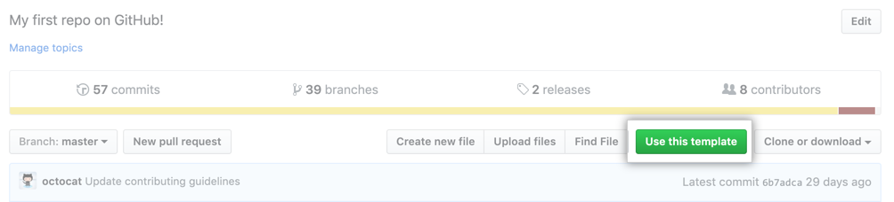

<div align="center">
  
  

# Template to use TypeScript with k6


</div>

This repository provides a scaffolding project to start using Typescript with k6.

## Rationale

While JavaScript is great for a myriad of reasons, one area where it fall short is type safety and developer ergonomics. It's perfectly possible to write javascript code that will look OK and behave OK until a certain condition forces the executor into a faulty branch.

While it, of course, still is possible to shoot yourself in the foot with typescript as well, it's significantly harder. Without adding much overhead, Typescript will:

- Improve the ability to safely refactor your code.
- Improve readability and maintainablity.
- Allow you to drop a lot of the defensive code previously needed to make sure consumers are calling functions properly.


## Prerequisites

- [k6](https://k6.io/docs/getting-started/installation)
- [NodeJS](https://nodejs.org/en/download/)
- [Yarn](https://yarnpkg.com/getting-started/install) (optional)

## Installation

**Creating a repository from the `example-typescript` template**

We have configured this project as a GitHub template to simplify starting a new Typescript project. Navigate to the [example-typescript](https://github.com/k6io/example-typescript) page and click **Use this template**.

  


**Install dependencies**

Move to the project root folder and install the dependencies defined on [`package.json`](./package.json)

```bash
$ yarn install
```

## Running the test

To run a test written in typescript, we first have to transpile the typescript code into javascript and bundle the project

```bash
$ yarn webpack
```


Once that is done, we can run our script the same way we usually do, for instance:

```bash
$ k6 run dist/test1.js
```

### Transpiling and Bundling

By default, k6 can only run ES5.1 Javascript code. To use typescript, we have to set up a bundler that converts typescript to javascript code. 

This project uses `Babel` and `Webpack` to bundle the different files - using the configuration of the [`webpack.config.js`](./webpack.config.js) file.

If you want to learn more, check out [Bundling node modules in k6](https://k6.io/docs/using-k6/modules#bundling-node-modules).
